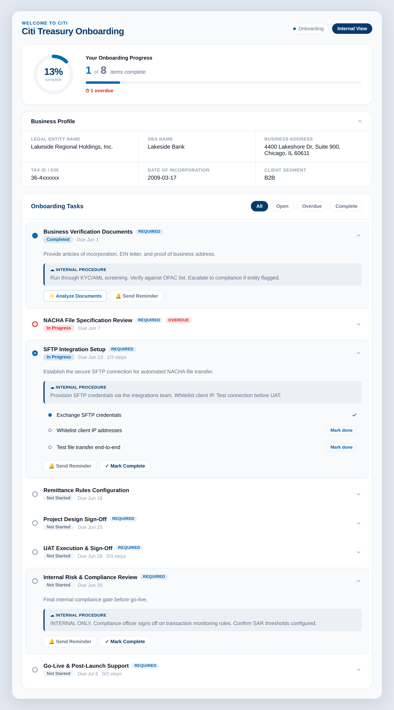
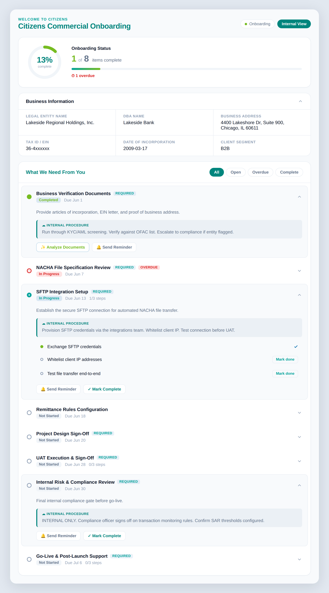
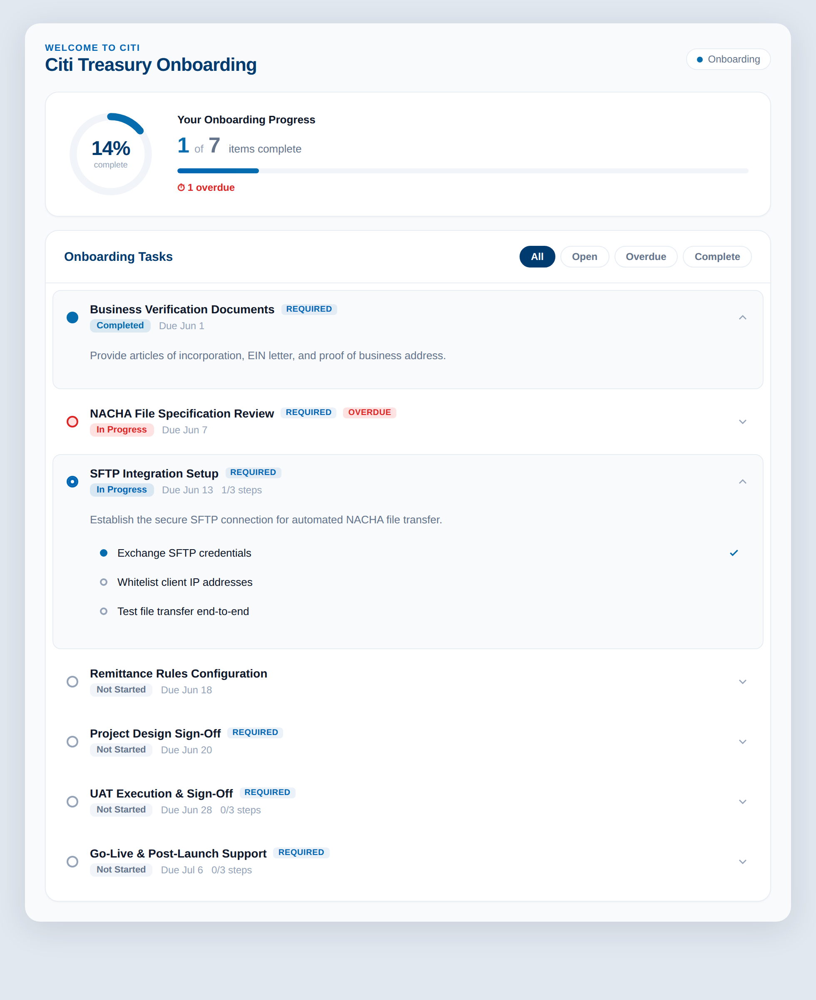
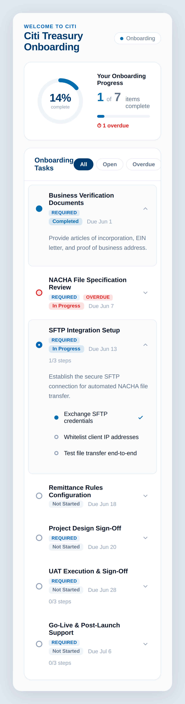

# Onboarding Hub — Phase 1

A white-label onboarding / KYC / enablement command center for Salesforce. This phase delivers the full data model, the Apex service + Agentforce action layer, and a modern, headless-style internal dashboard LWC that rebrands instantly per bank.

---

## Preview

The `onboardingHub` component, populated with the Phase 1 NACHA demo scenario (Lakeside Regional Holdings). More renders and the standalone HTML mockups live in [`docs/preview/`](docs/preview/).

**Internal ops view — instant rebrand by config (same data, same code):**

| Citi | Citizens |
|---|---|
|  |  |

**External / Experience Cloud portal view, and mobile:**

| Portal (desktop) | Portal (mobile) |
|---|---|
|  |  |

> The portal view is produced by the **same component** with `isInternal = false`. Internal procedure notes, the business-profile panel, and action chips are hidden — and items flagged `Visible_In_Portal__c = false` (e.g. *Internal Risk & Compliance Review*) are **filtered server-side in `getDashboard()`**, so external users never receive them and progress recalculates accordingly (1 of 7 = 14%, vs 1 of 8 internally).

---

## What's in Phase 1

**4 custom objects**
- `Checklist__c` — parent. 2 record types (Client, Employee). Holds type (Onboarding/KYC/Enablement), client segment (B2B/B2C/Public/Private/Partner/Real Estate/Cannabis), status, dates, progress %, preferred comms channel, specialist/sales/manager lookups, and the AI-populated business fields (DBA, legal entity, address, tax ID, incorporation date).
- `Checklist_Item__c` — child (master-detail). Required flag, due date, signature flags, status, category, reminder tracking (count, last date, channel), document handling (requires doc, count, AI analysis enabled/status, doc generation enabled), step rollups, and `Visible_In_Portal__c` to control what clients see.
- `Checklist_Item_Step__c` — grandchild (master-detail). The 2-3 sub-steps per item. Title, sequence, status, completed date.
- `Dashboard_Config__c` — white-label branding. Logo URL, title, 3 colors, section labels, section visibility flags, internal-vs-external flag.

**Apex**
- `OnboardingDashboardController` — cacheable `getDashboard()` that returns checklist + branding + items + steps in one call, plus `completeStep()` / `completeItem()` with automatic rollup to progress %. Portal-visibility filtering happens server-side so external users never receive internal items.
- `OnboardingAgentActions` — invocable methods so an Agentforce Service Agent can read checklist status and complete items in conversation.
- `OnboardingDashboardControllerTest` — full test coverage.

**LWC: `onboardingHub`**
- Animated SVG progress ring + bar, skeleton loading states, expandable items with steps, status dots, filter pills (All/Open/Overdue/Complete), brand-driven CSS custom properties.
- Internal view shows internal procedure notes + action chips (Analyze Documents, Generate & Send, Send Reminder, Mark Complete). External view hides all of that.
- Works on App/Home/Record pages AND Experience Cloud, driven by the `isInternal` property.

---

## Deploy

```powershell
# Unzip, then from the project root (where sfdx-project.json lives):
sf project deploy start --source-dir force-app --ignore-conflicts
```

Then load the demo data:

1. Open Developer Console → Debug → Open Execute Anonymous Window
2. Paste the contents of `OnboardingHub_Phase1_DemoData.apex`
3. Execute
4. Copy the Checklist Id from the debug log

---

## See it work

**Internal view (ops):**
1. Open the Checklist record (or any Lightning page)
2. Edit Page → drag **Onboarding Hub** onto the canvas
3. Set **Internal View = ON**, optionally set **Branding Config Name = Citi**
4. Save & Activate

**Instant rebrand:**
- Change the component's **Branding Config Name** property to `Citizens` — or change the checklist's `Dashboard_Config_Name__c` field — and the whole dashboard recolors, relogos, and relabels.

**Agentforce:**
- The two invocable actions (`Get Onboarding Checklist Status`, `Complete Onboarding Item`) are now available to add as Agent Actions in Agentforce Builder.

---

## The NACHA demo scenario

The demo data builds a realistic mid-market bank onboarding for "Lakeside Regional Holdings" — the exact NACHA-into-ERP journey you described: business verification → NACHA spec review → SFTP setup (with sub-steps) → remittance rules → design sign-off → UAT (with sub-steps) → internal compliance gate (portal-hidden) → go-live + hypercare (with sub-steps). Progress sits around 19% so you can demo completing steps and watching the ring animate up.

---

## What's coming next

**Phase 2** — Experience Cloud deployment (client-facing, simplified) + document upload (max 2/item) + real end-to-end Agentforce Prompt Builder document analysis on the Business Verification item (extract DBA/address/entity → write to fields → auto-complete → advance progress).

**Phase 3** — Reminder/escalation engine (scheduled Apex, past-due detection, channel routing per preferred method, manager escalation on the 3rd reminder), real email + bell notifications (Slack/SMS simulated with wiring docs), document generation + email-back, and Salesforce Scheduler integration.

**Phase 4 (optional)** — Supabase external data layer for raw integration/file telemetry.

---

## Notes

- The AI/Generate/Remind buttons currently fire informational toasts pointing to their phase. The data model and UI hooks are all in place so wiring them is additive — no rework.
- Employee record type is created and ready; Phase 2/3 will align the employee flow to the HR Service data model with portal-only completion as you specified.
- Master-detail relationships mean steps and items inherit sharing from the parent checklist — important for Experience Cloud security.
